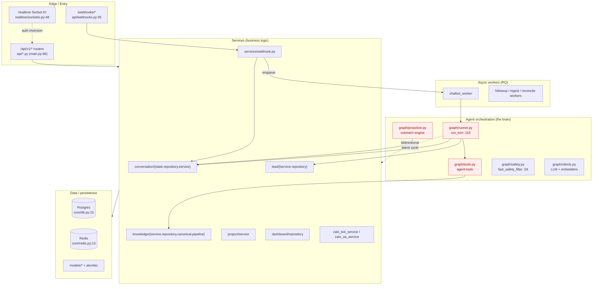

# Backend Architecture Audit — VFIC ChatBot (Ting Ting)

**Date:** 2026-07-08 · **Scope:** whole `backend/app` · **Method:** `improve-codebase-architecture` (Map → Catalog → Deliver) · **Mode:** read-only audit, no code changed.

**Headline:** The backend is **well-layered** (`api → services → repositories → models`, dependency rule holds) and most list endpoints are paginated with indexes on hot paths. The problems are concentrated, not diffuse. The four highest-leverage issues are: (1) the central `ConversationService` facade has **no type contracts**, (2) the **agent brain (`graph/`) is largely untested**, (3) **lead-list read-path serializes all traffic** through a per-read advisory lock + materialization, and (4) a **latent import cycle** between `graph/` and `services/`. None is an outage today; all four will block scaling or safe refactoring.

---

## 1. Architecture Map

### Entry points
- **App boot:** `app/main.py:84` (`FastAPI(...)`); `lifespan` at `main.py:37-81` seeds default persona and registers two rq-scheduler ticks (proactive follow-up `main.py:67`, reconcile sweep `main.py:72`).
- **Routers:** registered `main.py:96-108` under `/api/v1` (auth, users, conversations, leads, bot_runs, knowledge, projects, personas, jobs, dashboard, integrations, realtime) + `/realtime` + bare `/webhooks`.
- **Realtime:** `main.py:226` wraps the FastAPI app in `socketio.ASGIApp` so Socket.IO rides the same ASGI root; `sio = AsyncServer(...)` built at import (`realtime/socketio.py:48`).
- **Workers (separate processes):** `workers/{chatbot,followup,ingest,persistence,reconcile}_worker.py`.

### Layer boundaries — verdict
Dependency rule **mostly holds**. Two exceptions:
- `api/auth.py:140-151` and `api/knowledge.py:390` call `await db.commit()` directly inside route handlers (business logic + persistence in the API layer).
- `realtime/socketio.py:22` imports `get_user_from_token` from `api/dependencies` — minor cross-cutting inversion for shared auth.

No upward imports from `models/` or `schemas/` into `services/`/`api/`.

### Shared state / coupling points
- `core/db.py:15-16` — module-level `engine` + `async_session` (singleton pool).
- `core/redis.py:13-14` — lazily-built process-wide Redis clients.
- `core/config.py:239` — `@lru_cache` on `get_settings()`.
- `realtime/socketio.py:48` — module-level `sio`.
- `graph/clients.py:23-26` — module-level Redis metric keys shared with `main.py:158-173` (`/health/queue`). Tight cross-module coupling to metrics keys.
- **Config captured at import time** in 5 sites (`core/db.py:13`, `core/redis.py:11`, `core/security.py:23`, `realtime/emitter.py:19`, `realtime/socketio.py:26`, `services/conversation/state.py:32`) — tests that mutate settings after import won't see the change.

### Data flow (inbound Zalo bot webhook → bot reply)
`POST /webhooks/zalo/chatbot` (`api/webhooks.py:35`) → secret verify via `IntegrationSettingsService.resolve_zalo` (`webhooks.py:52`) → `ZaloWebhookService.handle` (`services/webhook.py:93`) → normalize → `MessageDedupService.claim` → `ConversationService.ensure` → `record_inbound` → `run_start_guard` → `acquire_lock` → enqueue RQ (`webhooks.py:150`) → `run_chat_turn_job` (`workers/chatbot_worker.py:39`) → `build_deps` (`graph/factories.py:65`) → `run_turn` (`graph/runner.py`) → nodes call `ConversationService`/`RetrievalRepository`/`LeadRepository` + `deps.zalo` sender → `record_bot_outcome` (`conversation/state.py:185`) → Socket.IO emit via `AsyncRedisManager`.

---

## 2. Architecture Diagram

**Red nodes** (`runner`, `tools`, `proactive`) = the agent brain — **largely untested** (see F-CRIT-2). **Dashed edges** = the two structural smells: the soft `graph ↔ services` cycle, and the realtime→api auth inversion.

---

## 3. Critical Issues (ranked by impact)

Priority order follows: data-integrity / throughput → architectural blockers → maintainability → cosmetic.

### F-CRIT-1 — `ConversationService` facade erases all type contracts  · *Critical (maintainability)*
`app/services/conversation/__init__.py:40-145` — all 28 public methods are `async def get(self, *args, **kwargs)` with **zero annotations**. This is the central conversation interface consumed by graph, API, webhook, and proactive layers. Every caller must read `ConversationState`/`ConversationRepository` to discover signatures; mypy/pyright verify nothing. Highest blast-radius typing gap in the codebase.

### F-CRIT-2 — The agent brain (`graph/`) has near-zero test coverage  · *Critical (refactor safety)*
`graph/tools.py` (273 LOC, 0 test refs), `graph/proactive.py` (325 LOC, only rules tested), `graph/runner.py` (229 LOC, only indirect refs), `graph/schemas.py` (134 LOC), `graph/prompt_context.py` (55 LOC). Overall: **13/47 modules (28%) have a dedicated test file; 22 modules (47%) have zero test references.** You cannot safely refactor the agent brain without characterization tests — every architectural fix below is blocked or risk-doubled by this.

### F-HIGH-1 — Lead-list read-path serializes all traffic via per-read advisory lock + materialization  · *High (throughput cliff)*
`services/lead/service.py:89-92,157-159` + `repository.py:233-247` — every `LeadService.list(materialize=True)` and `board()` runs `pg_advisory_xact_lock(hashtext('materialize_conversation_leads'))` then `INSERT ... SELECT FROM conversations WHERE NOT EXISTS (...)`. The lock **serializes all lead-list requests across the whole deployment** (one recruiter's board blocks another's list until commit). The anti-join scans `conversations` fully each time, unbounded. This is the single biggest scalability defect.

### F-HIGH-2 — Lead board issues 10+ DB round-trips per refresh  · *High (latency)*
`services/lead/service.py:147-206` — `board()` loops 5 sections, each calling `list()` → independent `COUNT(*)` + `SELECT ... LIMIT`; the `needs_reply` branch adds two correlated `EXISTS` subqueries. One board refresh = 10+ round-trips + the materialization lock above. Multiplies with concurrent recruiters.

### F-HIGH-3 — LLM/embedding concurrency limits default to 0 (disabled)  · *High (burst reliability)*
`core/config.py:158,162` — `llm_concurrency_limit: int = 0`, `embed_concurrency_limit: int = 0` make the Redis semaphores in `llm_semaphore.py:72` pass-through no-ops. Under a burst, every RQ worker hits MiniMax/Gemini unthrottled → provider 429s → graceful-degradation retry storm. Operational fix (config), not a refactor.

### F-HIGH-4 — DB engine pool is untuned  · *High (capacity)*
`core/db.py:15` — `create_async_engine(..., pool_pre_ping=True, future=True)` with no `pool_size`/`max_overflow`/`pool_timeout`/`pool_recycle`. SQLAlchemy defaults (5/10/30s) cap the box at ~15 connections; concurrent inbox loads queue then `TimeoutError`. Operational fix.

### F-HIGH-5 — Latent import cycle: `graph/` ↔ `services/`  · *High (architectural blocker)*
`graph/{runner.py:37, tools.py:28, context.py:19, proactive.py:25}` import services at top level; `services/{project/service.py:219,459,568, seeder.py:23}` import graph **lazily** (function-level). No hard `ImportError` today, but the LangGraph layer and service layer are inseparable, and one new top-level `from app.graph` in a service that graph imports will crash boot.

### F-HIGH-6 — Lead service is a 713-LOC, 6-responsibility god module  · *High (velocity)*
`services/lead/service.py` mixes CRUD (`list/board/update/assign/set_stage`), AI chatops-assist (`build_chatops_assist:354`, `apply_chatops_action:383`), tag normalization (`_normalize_manual_tag_payloads`), and view-model building (`_signals/_missing_fields/_suggested_reply`). Biggest velocity drag in the lead subdomain.

### F-HIGH-7 — `knowledge/repository.py` (736 LOC) bundles 4 unrelated repositories  · *High (merge/conflict risk)*
`KnowledgeChunkRepo`, `KnowledgeDocumentRepo`, `JobFeatureValueRepo`, `ProjectIndexRepo` + 3 module functions (`rebuild_bus_timetable:631`, `mark_document_failed_sync:691`, `mark_version_failed_sync:720`) share one file across 4 independent tables.

### F-HIGH-8 — Viewer-scope business rule duplicated across 13+ sites in two syntaxes  · *High (rule drift)*
`(assigned_recruiter_id = :uid OR assigned_recruiter_id IS NULL)` appears **8× in raw SQL** (`dashboard/repository.py:30,42,54,66,78,99,127,143,157`) and as ORM `or_(...)` in `conversation/repository.py:55-61,131-138,184-190` and `lead/service.py:94-97,686-690`. The "admin=all, recruiter=own+unassigned" invariant is re-implemented everywhere; a rule change means editing 13+ call sites (and it has already drifted once — `leads_by_stage:143` omits the table alias).

### F-HIGH-9 — Safety-critical functions return opaque `dict`  · *High (correctness/security)*
`graph/safety.py:18` (`fast_safety_filter -> dict`, 6 keys), `safety.py:57` (`parse_verdict(raw) -> dict`), `runner.py:115` (`run_turn -> dict`, 5 variant shapes), `core/security.py:35` (`decode_token_sync -> dict` = raw JWT payload). String-keyed access means any rename silently breaks the safety gate; wrong key access in the auth layer is a security bug. Should be `TypedDict`/dataclass.

### F-HIGH-10 — Raw `text()` SQL in 192 sites despite ORM models existing  · *High (dual source of truth)*
e.g. `knowledge/repository.py:47-58` issues `text("DELETE/INSERT INTO knowledge_chunks ...")` while `models/knowledge.py` defines the same table. Column renames must happen in two places; ORM type safety is forfeited. (Partly deliberate — Alembic manages schema via raw SQL — but the duality is a silent maintainability tax.)

### F-MED-1..N — see §5 index
`canonical.py` (850 LOC) embeds bus-timetable domain into generic markdown parsing (`A5`); `project/service.py` (601 LOC) = CRUD + FAQ CRUD + feature extraction + LLM (`A7`); dashboard repo 9 copy-pasted scoped-count blocks (`B2`); Zalo Bot vs OA parallel client code (`B1`); 29/119 endpoints have no `response_model` (`D7`); 83 broad `except Exception` with no shared helper (`D8`); hardcoded auth rate-limit knobs (`D6`); MiniMax tool loop strictly sequential — per-turn latency (`C9`); `build_project_index` sends ≤200 chunks (~50K tokens) in one LLM call (`C7`); reconcile candidate scan grows with volume (`C8`); duplicate `_parse_candidate_json`/`parse_lead_json` verbatim clone (`D4`).

---

## 4. Refactoring Strategies (top issues — what / why / risk / verify)

> These are **strategies**, not yet executed. The user chose *audit + report only*. Each execution should go through characterization-tests-first → one concern per commit (`refactor-clean-architecture`).

### F-CRIT-1 — Type the ConversationService facade
- **Change:** Add real signatures (or replace the `*args/**kwargs` facade with direct re-exports / a typed protocol). Annotate all 28 methods.
- **Why:** Unlocks static analysis across the most-used interface; turns silent breakage into type errors.
- **Risk:** Low — signatures only, no behavior change. Some call sites may surface pre-existing latent type errors.
- **Verify:** `mypy`/`pyright` clean; full `pytest` green; no behavior change (this is the textbook characterization-test-first refactor).

### F-CRIT-2 — Characterization tests for the agent brain
- **Change:** Add tests covering `graph/runner.py` turn outcomes, `graph/tools.py` tool dispatch, `graph/proactive.py` outreach decision (not just rules). Use record/replay of LLM responses (the codebase already has graceful-degradation paths to pin).
- **Why:** Unblocks every other graph-layer refactor safely. This is the prerequisite, not an optional nice-to-have.
- **Risk:** Low (test-only). Medium effort.
- **Verify:** coverage on the three modules rises from ~0; existing 261 tests still pass.

### F-HIGH-1 / F-HIGH-2 — Decouple lead-list read path
- **Change:** Move `materialize_conversation_leads` out of the read path — either a periodic RQ worker or an insert-time trigger — and **drop the transaction advisory lock**. Collapse `board()`'s 5-section loop into one query (window functions) or materialize sections async.
- **Why:** Removes the cross-request serialization that will cap the whole deployment as conversation volume grows.
- **Risk:** **High** — touches the most-read path; must prove the materialized state stays consistent. Requires the F-CRIT-2 tests first.
- **Verify:** load test concurrent board refreshes (lock contention drops to zero); row-count parity before/after; existing lead tests green.

### F-HIGH-5 — Break the graph ↔ services cycle
- **Change:** Invert the dependency — define small service **interfaces** (typed protocols) in `graph/` (or a shared `ports/` module) that the service layer implements; graph depends on the port, not the concrete service. Remove the lazy imports.
- **Why:** Makes the LangGraph layer independently testable and boot-safe.
- **Risk:** Medium — interface extraction across multiple call sites.
- **Verify:** `python -c "import app.graph"` and `import app.services` both succeed with no lazy-import crutch; no circular-import warnings; tests green.

### F-HIGH-6 / F-HIGH-7 / F-MED (canonical, project) — Split god modules by concern
- **Change:** Apply the four-layer split per module:
  - `lead/service.py` → `lead/service.py` (CRUD) + `lead/chatops.py` (AI-assist) + `lead/tags.py` (normalization) + `lead/viewmodels.py` (signals).
  - `knowledge/repository.py` → one repo file per table (`chunk_repository.py`, `document_repository.py`, `job_feature_repository.py`, `project_index_repository.py`).
  - `canonical.py` → `canonical.py` (generic parser) + `bus_timetable/repair.py` (domain-specific).
  - `project/service.py` → extract `faq/` and `features/` sub-services.
- **Why:** Reduces merge conflicts, isolates changes, makes each piece independently readable.
- **Risk:** Low–medium (move-don't-rewrite). Must keep imports updated and verify no circular imports.
- **Verify:** behavior-frozen — same outputs; `pytest` green per commit.

### F-HIGH-8 — Centralize the viewer-scope rule
- **Change:** One `apply_viewer_scope(stmt, viewer, column)` helper (ORM) + `scope_sql(snippet, recruiter_id)` (raw SQL); replace all 13+ sites.
- **Why:** Single source of truth for an authorization invariant; prevents the drift already seen in `leads_by_stage`.
- **Risk:** Low (mechanical) but security-sensitive — must keep behavior identical.
- **Verify:** existing scope tests green; add a parametrized test for admin vs recruiter vs unassigned across all list endpoints.

### F-HIGH-9 — Type safety-critical dict returns
- **Change:** `TypedDict`/dataclass for `fast_safety_filter`, `parse_verdict`, `run_turn` outcomes, and `decode_token_sync`.
- **Why:** Compile-time protection for the safety gate and auth layer.
- **Risk:** Low (type-only).
- **Verify:** type checker green; tests green.

### F-HIGH-3 / F-HIGH-4 — Operational config (no refactor)
- **Change:** Set `llm_concurrency_limit`/`embed_concurrency_limit` to plan-appropriate values; add `pool_size`/`max_overflow`/`pool_recycle` to the engine.
- **Why:** Biggest reliability/capacity win for the least code change.
- **Risk:** Low (env-config tuning).
- **Verify:** load test; monitor provider 429 rate and DB pool wait metrics.

---

## 5. Full Findings Index (by dimension)

### A. Layering & god-files
| ID | Sev | Finding | Location |
|---|---|---|---|
| A1 | High | graph ↔ services bidirectional coupling (latent cycle) | `graph/runner.py:37` etc. ↔ `services/project/service.py:219` etc. |
| A2 | High | `knowledge/repository.py` (736) bundles 4 repos + 3 fns | `services/knowledge/repository.py:35,298,317,561,631,691,720` |
| A3 | Med | Route handlers commit to DB directly | `api/auth.py:140-151`, `api/knowledge.py:390` |
| A4 | High | `lead/service.py` (713) 6 responsibilities | `services/lead/service.py:64,354,383` |
| A5 | Med | `canonical.py` (850) embeds bus-timetable domain | `services/knowledge/canonical.py:291,302,436,638` |
| A6 | High | Raw `text()` SQL in 192 sites vs ORM models | `services/knowledge/repository.py:47-58` + 28 files |
| A7 | Med | `project/service.py` (601) CRUD+FAQ+features+LLM | `services/project/service.py:214,251,317,458,507,553` |
| A8 | Low | `knowledge/service.py` (603), `api/knowledge.py` (390) large but cohesive | — |
| A9 | Low | `conversation/state.py` (579), `retrieval/repository.py` (584) cohesive — NOT god modules | — |
| A10 | Low | realtime imports from api (auth inversion) | `realtime/socketio.py:22` |

### B. Duplication
| ID | Sev | Finding | Locations |
|---|---|---|---|
| B1 | High | Zalo Bot vs OA parallel HTTP transport + envelope projection + chunk loop | `zalo_bot_service.py:114-161,262-302` ↔ `zalo_oa_service.py:34-115` |
| B2 | High | Dashboard repo 9 copy-pasted scoped-count blocks | `dashboard/repository.py:23-160` |
| B3 | High | Viewer-scope predicate ×13 in 2 syntaxes | `dashboard/repository.py` ×8; `conversation/repository.py:55,131,184`; `lead/service.py:94,686` |
| B4 | Med | Lead shape mirrored in model + 2 SQL lists + 2 schemas | `models/lead.py:49-91`, `lead/repository.py:18-60`, `schemas/lead.py:14-85` |
| B5 | Med | Zalo Bot admin methods re-implement `_send_result` tail ×7 | `zalo_bot_service.py:351-453` |
| B6 | Med | Two embedders, identical contract, no Protocol | `graph/clients.py:127-176,179-233` |
| B7 | Med | `_unanswered_inbound_condition` duplicated ORM vs inline | `conversation/repository.py:35-43` ↔ `lead/service.py:680-684` |
| B8 | Low | `_minimax_chat`/`_openrouter_chat` boilerplate | `graph/clients.py:374-429` |

### C. Performance & scalability
| ID | Sev | Finding | Location |
|---|---|---|---|
| C1 | High | LLM/embed concurrency limits default 0 (disabled) | `core/config.py:158,162` |
| C2 | High | DB engine pool untuned | `core/db.py:15` |
| C3 | High | Lead board 10+ round-trips per refresh | `lead/service.py:147-206` |
| C4 | High | materialize-on-read + advisory lock serializes traffic | `lead/service.py:89-92,157-159`, `repository.py:233-247` |
| C5 | High | OpenRouterEmbedder new httpx client per sub-batch | `graph/clients.py:220` |
| C6 | Med | `leave_viewing` O(N) Redis round-trips; `get_typing_users` uses scan | `services/presence.py:53-70,132` |
| C7 | Med | `build_project_index` sends ≤200 chunks (~50K tok) in one call | `knowledge/pipeline.py:236-244`, `repository.py:567-582` |
| C8 | Med | Reconcile candidate correlated subquery grows with volume | `conversation/repository.py:313-380` |
| C9 | Med | MiniMax tool loop strictly sequential | `graph/clients.py:295-325` |
| C10 | Med | `messages_since` unbounded default limit 200 | `conversation/repository.py:244-281` |

### D. Maintainability & tests
| ID | Sev | Finding | Location |
|---|---|---|---|
| D1 | Critical | ConversationService facade `*args/**kwargs`, no types | `services/conversation/__init__.py:40-145` |
| D2 | Critical | graph brain (tools/runner/proactive) untested | `graph/tools.py`, `graph/runner.py`, `graph/proactive.py` |
| D3 | High | Safety/auth functions return opaque dict | `graph/safety.py:18,57`, `runner.py:115`, `core/security.py:35` |
| D4 | High | Duplicate JSON-parse functions verbatim | `candidate_extraction.py:38` ↔ `lead/normalizers.py:13` |
| D5 | High | `normalize_lead` bare-dict return — core contract untyped | `lead/normalizers.py:118`, `lead/repository.py:128` |
| D6 | Med | Hardcoded auth rate-limit knobs (6 policies) | `api/auth.py:59,74-75,88-89,102` |
| D7 | Med | 29/119 endpoints have no `response_model` | `api/conversations.py:91`, `api/leads.py:294`, `api/personas.py:109` |
| D8 | Med | 83 broad `except Exception`, no shared helper | across `app/` (e.g. `graph/clients.py` ×12) |
| D9 | Med | Hardcoded tuning knobs in LLM path | `graph/clients.py:116,38-64`, `factories.py:26,52,76`, `safety.py:33` |
| D10 | Low | `zalo_oa_oauth` deletion left no orphans (clean); new `zalo_oa_events.py` untested | `services/zalo_oa_events.py:1` |

**Quantified:** test coverage 13/47 modules (28%); 22 modules (47%) zero test refs; 83 broad-except; ~38 bare `-> dict` returns; 29/119 endpoints without `response_model`; 1 verbatim clone pair; 0 orphaned refs from the Zalo OAuth removal.

---

## 6. Recommended execution priority (decision gate)

If/when execution is approved, ship in this order — each is independently deployable:

1. **Operational config first (cheapest, biggest win):** F-HIGH-3 + F-HIGH-4 (concurrency limits, DB pool). No refactor, env tuning + load test.
2. **Unblock safe refactoring:** F-CRIT-2 (characterization tests for `graph/`) — prerequisite for items 4–6.
3. **Type the core contracts:** F-CRIT-1 (ConversationService facade) + F-HIGH-9 (safety/auth dict returns). Low-risk, high-leverage.
4. **Centralize authorization:** F-HIGH-8 (viewer-scope helper) — security-sensitive, mechanical.
5. **Throughput cliff:** F-HIGH-1 + F-HIGH-2 (decouple lead-list read path) — highest risk, needs item 2 first.
6. **Break the cycle + split god modules:** F-HIGH-5 (graph↔services ports), F-HIGH-6/F-HIGH-7/F-MED (lead/knowledge/project splits).
7. **Cleanup pass:** duplication (B1, B2, B5), response envelopes (D7), error handling (D8), externalize knobs (D6/D9).

**Sequencing note:** the working tree currently holds uncommitted Zalo OA refactor changes. Any multi-commit refactor sequence should land *after* those are committed to keep history reviewable.
