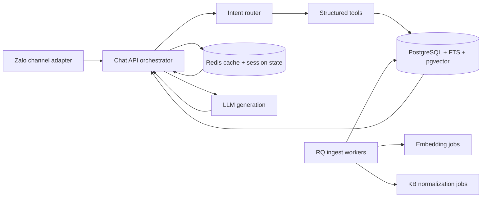

# Technical Design for a Job-Posting Chatbot Backend

## Recommended system shape

For your current phase, I would not build this as a broad autonomous “agent.” I would build it as a **bounded retrieval-and-ranking system** with a small set of deterministic tools behind it: job search, job detail lookup, bus schedule lookup, recommendation, and conversation-state update. That design is easier to keep fast, cheaper to run on a 2 vCPU / 4 GB droplet, and much easier to test. FastAPI is built for asynchronous request handling and can mix `async def` and normal `def` handlers, while Uvicorn supports multiple worker processes when you want to use both CPU cores. Redis-backed job queues are specifically meant to keep background work off user-facing request paths. citeturn5view1turn5view2turn17view0turn7view0

Your current stack already has many of the right building blocks: FastAPI, PostgreSQL, pgvector, Redis, RQ, and Socket.IO. The biggest architectural change I recommend is this: **keep RQ for ingestion, re-embedding, digests, and slow follow-up tasks, but remove it from the synchronous answer path**. Redis job queue guidance explicitly frames queues as a way to offload background work from user-facing request paths so latency stays low; that is exactly how you should use it here. citeturn7view0

A good target for this phase is **100 active conversations**, not 100 simultaneous model generations at once. On a small server, the backend should mostly spend its time waiting on PostgreSQL, Redis, and external model APIs rather than doing heavy CPU work locally. MiniMax’s model docs describe `MiniMax-M2.7-highspeed` as a low-latency variant and note approximate output speed around 100 tokens per second, and its API supports streaming; that makes it suitable for fast first-token response if you keep prompts compact and retrieval precise. citeturn7view3turn14view0

The channel integration should be intentionally thin. Treat Zalo Bot / OA as an **ingress and egress adapter** that normalizes inbound messages into an internal event model and sends outbound replies back through the right channel-specific API. Everything that matters for quality and speed should live in the backend service layer, not in the Zalo adapter. That lets you add web chat, Facebook, Telegram, or app chat later without redesigning retrieval or recommendations.

## Knowledge modeling and storage

The single most important design decision is to **store job knowledge in both structured and searchable forms**. Bus timetables, locations, shifts, salary ranges, employment type, required documents, benefits, dormitory support, age/education requirements, and routing information should exist as **first-class relational tables**. At the same time, you should build **search documents** for RAG from those same records so the model can answer natural-language questions. PostgreSQL full-text search is built around `tsvector`, `tsquery`, and ranking functions, and pgvector lets you keep vectors in the same database as your relational data. citeturn5view3turn6view3

For job-posting chatbots, arbitrary token chunking is usually worse than **semantic chunking by business section**. Instead of slicing every posting into generic 500-token windows, create documents like: “overview,” “job description,” “special requirements,” “benefits and perks,” “salary and compensation,” “location and commute,” “bus route A,” “bus route B,” “application process,” and “FAQ.” This gives retrieval much cleaner units and makes citation and explainability easier. PostgreSQL’s built-in ranking helps lexical lookup, while vector retrieval covers paraphrases and colloquial Vietnamese phrasing. citeturn5view3turn16view0

I would model the database roughly like this:

- `job_posting`
- `job_posting_section`
- `job_requirement`
- `job_benefit`
- `job_bus_route`
- `job_bus_stop`
- `job_shift`
- `job_location`
- `job_search_doc`
- `candidate_profile`
- `candidate_preference`
- `conversation_state`
- `retrieval_cache`

The `job_search_doc` table is the key search surface. Each row should represent one retrievable unit with fields such as `posting_id`, `section_type`, `language`, `text`, `json_payload`, `tsvector`, `embedding`, `status`, `effective_from`, and `effective_to`. For bus schedules, keep the authoritative timetable in structured rows and also generate a human-readable retrieval document like: “Shuttle route 03 leaves Stop A at 06:10, 06:40, 07:15 on weekdays; return buses leave factory gate at 17:40 and 19:10.” That way, exact schedules come from SQL, but general questions such as “is there a morning bus from Bien Hoa?” still retrieve well.

Your current use of 3,072-dimensional embeddings plus `halfvec` HNSW is technically sensible. pgvector’s HNSW indexes support `vector` up to 2,000 dimensions but `halfvec` up to 4,000 dimensions, so a 3,072-d model needs either **half-precision indexing** or dimension reduction. pgvector also notes that HNSW usually gives better query performance than IVFFlat, though at the cost of slower build times and more memory. For filtered queries, pgvector 0.8 added **iterative index scans**, which matter a lot in production because filtering after ANN search can otherwise return too few rows. citeturn5view0turn6view2turn6view3turn6view1

Because your present hardware is small, I would benchmark two embedding paths before locking the system: **keep `text-embedding-3-large` with halfvec indexing**, or move to a smaller embedding footprint. OpenAI’s embeddings docs say `text-embedding-3-large` defaults to 3,072 dimensions and supports reducing dimensions with the `dimensions` parameter; the model page also describes it as the most capable embedding model for English and non-English tasks. By contrast, `text-embedding-3-small` is much cheaper. If Vietnamese search quality remains acceptable in your eval set, a smaller model or reduced dimensions can materially lower storage, index size, and cost. citeturn5view4turn11view0turn11view1turn3search1

One subtle but important point: OpenAI’s embeddings docs say these embeddings are normalized to length 1, recommend cosine similarity, and note that cosine and Euclidean distance yield identical rankings. That means you do not need elaborate distance experimentation at this stage. Focus your quality effort on **document design, filters, hybrid retrieval, and reranking**. citeturn19view0turn19view2

## Retrieval and answer generation

The online answer path should be **short, deterministic, and measurable**:

1. Receive message and normalize it.
2. Load conversation state and candidate profile.
3. Check exact cache, then semantic cache.
4. Route the request into a small intent set.
5. Call one or more retrieval tools.
6. Rerank the retrieved evidence.
7. Generate the final answer from only the selected evidence.
8. Save trace, update state, and enqueue non-urgent follow-ups.

For routing, do not let the model freestyle. Use **structured outputs** to force the router into a small JSON schema such as `job_lookup`, `compare_jobs`, `bus_schedule_lookup`, `recommend_jobs`, `application_help`, `smalltalk`, or `unsupported`. OpenAI’s Structured Outputs docs explicitly describe JSON-schema-constrained output as a way to avoid missing required keys or invalid enum values, and function tools are similarly schema-defined. Even if your selected provider does not have equally strong native schema guarantees in every mode, you should still use schema-first parsing with validation and one retry. citeturn5view8turn5view9

For retrieval, I recommend **hybrid search**: lexical plus vector, then rerank. Elastic’s hybrid search documentation recommends combining full-text and vector results using **Reciprocal Rank Fusion**, and its RRF documentation explains why it works well across unrelated relevance signals with minimal tuning. In your case, the lexical side should be PostgreSQL FTS over `tsvector`, and the semantic side should be pgvector search over `job_search_doc.embedding`. citeturn16view0turn16view1turn5view3

A pragmatic retrieval plan is:

- Lexical search for exact terms like job codes, company names, industrial park names, bus stop names, shift labels, numeric benefits, and document names.
- Vector search for paraphrases like “xe đưa rước,” “shuttle,” “commute bus,” “boarding transport,” or “jobs near my area.”
- Structured filters for hard constraints such as active posting, location, salary band, gender-neutral policy, boarding support, shift type, or language.
- RRF fusion of lexical and vector lists.
- Multilingual reranking over the top 20–40 candidates.

That last step is important. Cohere’s docs describe `rerank-v4.0-fast` as a **multilingual**, **low-latency**, **high-throughput** reranker that can also handle semi-structured JSON documents. For Vietnamese and mixed structured/unstructured job data, that is a better fit than older English-only rerankers. Cohere also documents reranking as a standard final-stage improvement after semantic or lexical retrieval. citeturn5view7turn16view2turn5view6

Generation should be **grounded, not chatty**. The model prompt should include only:

- the user’s latest request,
- a compact conversation summary,
- the active job focus if one exists,
- the top reranked evidence chunks,
- explicit answer policy,
- output schema or formatting rules.

MiniMax’s docs show streaming support, and both MiniMax and Anthropic-style prompt caching support repeated prompt prefixes. MiniMax’s caching docs say caching applies to requests with 512 or more input tokens, uses prefix matching, and works best when static content is placed before dynamic user-specific content. That is exactly how you should structure your system prompt, tool descriptions, and citation policy. citeturn14view0turn23view0turn23view1

A strong answer policy for this domain is:

- answer only from retrieved evidence or structured tool results,
- prefer structured records over prose when both exist,
- if multiple job postings match, ask the user to confirm the target posting or present a short ranked shortlist,
- never invent schedules, benefits, or requirements,
- always mention the job title or code being discussed,
- if data is missing, say it is not available in the current posting.

If your product needs answer citations for recruiter auditability, include internal evidence IDs in generation and strip them or translate them into recruiter-facing source labels before final delivery.

You should also add **semantic response caching** in Redis for FAQ-like traffic. Redis’s semantic cache guidance is directly aligned with chatbot workloads: it is meant to reuse answers for semantically similar questions, reduce latency from multi-second LLM round-trips to tens of milliseconds, and lower token spend. This is especially valuable when many candidates ask near-duplicate questions like “is there a night shift?”, “does company support dorm?”, or “what documents are needed?”. citeturn21view0

## Recommendation engine for suitable jobs

A good job recommendation engine for phase one should be **content-based and constraint-aware**, not collaborative. You do not yet need matrix factorization or deep recommender models. OpenAI’s embeddings docs explicitly include recommendations as a valid use case and illustrate nearest-neighbor recommendations from embedding similarity. That is enough to build a useful early-stage recommender when combined with hard filters and business rules. citeturn11view0turn19view2

I would split recommendation into **hard filters**, **soft scoring**, and **explanations**.

**Hard filters** should remove clearly unsuitable jobs before scoring: inactive postings, wrong province, unsupported commute window, night-shift conflict, mandatory documents missing, education floor not met, or language requirement not met. These are deterministic SQL filters and should not be left to the LLM.

**Soft scoring** should rank the remaining jobs. A simple first-phase score can blend:

- semantic fit between candidate profile and job sections,
- required-skill overlap,
- preferred-skill overlap,
- location and commute fit,
- shift fit,
- salary fit,
- freshness or recruiter-priority boost.

You can represent both jobs and candidate profiles with embeddings, but I would not rely on embeddings alone. The better pattern is **filtered candidate set first, vector similarity second, rerank third**. The recommendation explanation should be generated from the top structured reasons: “matches your warehouse experience,” “bus available from Thu Duc,” “accepts high-school diploma,” “day shift,” and “includes dormitory support.”

To make recommendations work conversationally, maintain a **candidate preference object** that is continuously updated from chat. For example:

- target role types,
- preferred area,
- acceptable salary range,
- can work standing / overtime / shifts,
- commute tolerance,
- dormitory need,
- start date,
- prior factory experience,
- required benefits.

This profile can be updated by rules, by structured extraction, or by explicit questions from the bot. Again, structured outputs help: the model can extract preference deltas into a JSON schema instead of directly mutating free-form state. citeturn5view8turn5view9

One design detail that matters in recruitment systems: keep **recommendation reasons separate from recommendation scores**. The score is a backend ranking artifact; the reasons are user-facing and should be grounded in actual posting fields. That separation makes debugging dramatically easier when a recruiter says, “Why did the bot recommend this job?”

## Deployment and latency on your current droplet

On your present DigitalOcean droplet, the right strategy is **simplify before scaling**. Do not add more services unless they remove measurable latency or complexity.

The first concrete change I would make is to run the API server with **two Uvicorn workers**, not one, so both CPU cores are usable. FastAPI’s deployment docs and Uvicorn’s deployment docs both describe worker processes as the main way to handle more requests on multicore machines. citeturn5view2turn17view0

The second change is to make the online path fully asynchronous. FastAPI’s guidance is straightforward: use `async def` and `await` for network-bound libraries and API calls. That matches your workload, because the expensive parts are database, Redis, and external LLM requests, not local CPU computation. citeturn5view1turn17view2

The third change is to treat RQ as **strictly offline** for this phase. Use it for:

- ingestion of new postings,
- re-embedding,
- kb normalization and section generation,
- stale-cache warming,
- digest generation,
- follow-up recruiter analytics,
- retryable external webhooks.

Do **not** enqueue the main answer pipeline into RQ. Redis job queues exist to protect user-facing latency, not sit inside it. If you want to cap expensive background jobs, RQ now has a `RateLimit` feature that can restrict concurrency for jobs sharing a key. That is useful for embedding backfills or bulk digest jobs, but it should not be your user-turn orchestration mechanism. citeturn7view0turn7view1

For PostgreSQL connections, SQLAlchemy’s async engine uses an asyncio-compatible queue pool by default, and its pooling docs explain that total concurrent connections per process are bounded by `pool_size + max_overflow`. On a small box, that means you should set conservative limits and size them for real usage, not for theoretical peak load. A reasonable starting point is a small pool per worker rather than a large default-free-for-all. citeturn17view1

For Socket.IO, your current ASGI deployment approach is valid. The python-socketio docs describe `AsyncServer` plus `ASGIApp` as the standard async setup and explicitly support combining Socket.IO with FastAPI under ASGI. That said, use Socket.IO mainly for **frontend streaming, events, and typing/status updates**. It should not become your business-logic layer. citeturn18view0

For Redis messaging, be careful about reliability boundaries. Redis Pub/Sub has **at-most-once delivery semantics**, which means a disconnected or failing subscriber can lose the message permanently. So Pub/Sub is fine for transient fan-out such as “push this token chunk to the recruiter console,” but it is a bad foundation for critical workflow state. Redis’s own docs point to Redis Streams when you need stronger persistence and delivery guarantees. citeturn21view1

A sensible latency budget for this phase is a **design target**, not a guarantee:

- channel normalization and auth: tiny
- conversation state load: tiny
- exact / semantic cache check: very small
- routing: small
- hybrid retrieval + filters: small to moderate
- reranking: moderate
- generation first token: moderate
- full answer completion: moderate

That is achievable if you aggressively minimize context size. MiniMax’s prompt caching docs are highly relevant here: put static policies and tool descriptions first, keep dynamic state last, and reuse long prompt prefixes. That reduces both cost and prefill latency. Redis semantic caching further helps by skipping the full pipeline for repeated questions. citeturn23view0turn23view1turn21view0

In your specific stack, I would make these **keep / change / defer** decisions:

**Keep now:** FastAPI, PostgreSQL + pgvector, Redis, RQ, Docker Compose, Caddy, Socket.IO, recruiter console.

**Change now:** two Uvicorn workers; online path async and direct; hybrid retrieval with rerank; semantic cache; structured bus-schedule tables; stronger conversation-state schema; prompt-prefix caching; multilingual reranking.

**Defer to later:** LangGraph or full graph orchestration; horizontal scaling; external vector DB; cross-service event buses; local model serving; distributed tracing platform if your latency is not yet understood.

## Evaluation, observability, and release discipline

The fastest way to build the wrong chatbot is to ship it without evals. OpenAI’s evaluation best-practices docs are explicit: evals are the structured way to measure LLM application behavior in production-like conditions, and they recommend eval-driven development, task-specific tests, logging everything, and automating where possible. citeturn15view0turn15view1

For this system, I would create a **golden dataset** before expanding features. At minimum, include cases for:

- exact job-detail lookup,
- bus schedule lookup,
- benefit lookup,
- special requirement lookup,
- compare two jobs,
- “which job suits me?” recommendation,
- multi-turn preference refinement,
- Vietnamese paraphrases,
- stale or inactive posting handling,
- ambiguous job references,
- missing-data honesty,
- safety or unsupported edge cases.

OpenAI’s docs also emphasize datasets as a practical starting point for prompt and output testing, even before more elaborate evaluation frameworks. citeturn15view2

You already have benchmarking scripts, which is a strong start. I would expand them into a release gate that tracks:

- retrieval hit rate at top-k,
- reranked evidence correctness,
- factual answer correctness,
- groundedness / faithfulness,
- recommendation acceptance rate,
- p50 / p95 time to first token,
- p50 / p95 full answer latency,
- exact cache hit rate,
- semantic cache hit rate,
- prompt-cache read tokens,
- ANN fallback / iterative-scan frequency,
- queue depths for ingest jobs,
- stale-posting exposure rate.

Because your system is a hybrid of deterministic SQL and probabilistic generation, you should also log **tool inputs, tool outputs, selected evidence IDs, model choice, cache hits, and final answer metadata** on every turn. OpenAI’s eval guidance specifically recommends logging everything so you can turn real failures into new eval cases. citeturn15view0

A release workflow I would trust for this project looks like this:

First, ingest a small but realistic corpus of postings and bus schedules. Second, build the structured tables and search docs. Third, pass the golden dataset through retrieval only and fix recall issues. Fourth, add reranking and validate again. Fifth, add generation and require grounded answers. Sixth, enable exact cache and semantic cache. Seventh, measure latency on your droplet under synthetic load that resembles your real traffic pattern. Only after that should you add more agent-like behaviors.

## What I would change in your current design

Your earliest design is solid enough to evolve rather than replace. The main changes I would make are architectural, not ideological.

I would **keep FastAPI + PostgreSQL + pgvector + Redis + RQ**, because those tools are well-suited to a compact first deployment. PostgreSQL full-text search and pgvector let you keep structured and vector data in one place, which is a major simplification win at your size. Redis remains useful as queue broker, rate limiter, cache, and ephemeral state store. citeturn5view3turn6view3turn7view0

I would **replace the current “pipeline as jobs” mindset for user turns** with a direct request orchestrator. Use jobs only when the user does not need the result immediately. That one change will do more for your time-to-first-message than any micro-optimization in prompts. citeturn7view0

I would **upgrade your retrieval quality before adding more agent complexity**. Specifically: structured bus tables; section-based documents; PostgreSQL FTS; pgvector HNSW with iterative scan for filtered search; RRF fusion; and a multilingual reranker. Those are the highest-leverage backend improvements for your domain. citeturn5view3turn6view1turn16view0turn16view1turn16view2

I would **benchmark whether `text-embedding-3-large` is worth its cost in your corpus**. Its model page positions it as the strongest English and non-English embedding model, but `text-embedding-3-small` is much cheaper, and the embeddings API supports dimension reduction. On a job-posting workload with strong structured filters and rerank, a cheaper embedding layer may be completely sufficient. Do not guess here; measure it. citeturn11view0turn11view1turn5view4

I would also **formalize a router contract**. Use structured outputs to extract intent and filters; use function calls or deterministic service methods to fetch data; then use the LLM only for synthesis. This is the backend pattern most likely to stay understandable as features grow. citeturn5view8turn5view9

If you implement the system this way, your phase-one architecture stays small enough for a single droplet, fast enough to feel responsive, and disciplined enough to survive the move to the next phase, where you can later split ingestion, retrieval, and chat serving into separate scalable services without changing the conceptual model.