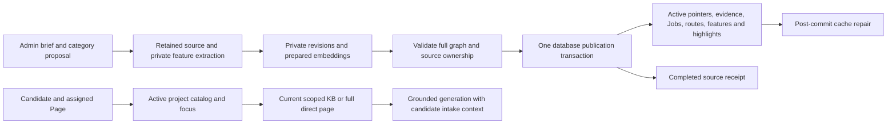

# Main audit: project training, recruitment, and admin reliability

Date: 2026-10-01. Baseline: `21cd171313bf0366e812a1e4ce379b47f633981c`
on `main`, confirmed equal to `origin/main` with `git ls-remote`. The worktree
was clean at task start. This report describes new audit fixes on that baseline;
earlier responsive design and one-file training work is already part of main.

The authorized artifacts are local source changes, regression tests, workflow
documentation, this audit record, the required completion record, and a portable
Git patch. Acceptance requires coherent project knowledge publication, recovery
without losing published data, scoped factual chatbot access, phone-first
candidate intake, safe admin editing, passing relevant checks, and a patch that
applies to a fresh baseline. No branch, commit, push, PR, merge, or deployment is
authorized or performed. Live providers and production state are outside local
verification.

## Root causes and fixes

| Confirmed finding | Resulting change | Regression proof |
|---|---|---|
| A brief published categories and feature values separately; later failure exposed a mixed snapshot. New Job IDs were checked against old sibling categories. | Prepare evidence and features privately, validate the complete proposed graph plus retained siblings, and publish pointers, projections, feature values, highlights, and source completion in one transaction. | Real PostgreSQL tests cover coherent Job ID replacement, embedding failure preserving the old snapshot, and SQL failure rolling back every published component. |
| Duplicate delivery at the final allowed category attempt revoked a live worker's token. | Preserve an unexpired processing claim before enforcing the attempt cap. | Duplicate delivery while the third attempt is live preserves its owner. |
| Legacy shadow training exposed new feature salaries while candidate retrieval still used the old KB; rollback ignored feature rows. | Defer source-owned features to explicit cutover, adopt only a current matching source, preserve newer independent edits, and restore pre-cutover features on rollback. The receipt and Vietnamese UI distinguish preparation from publication. | Real database regressions cover old salary/highlight preservation, atomic cutover adoption, stale-source exclusion, independent edits, and rollback. Shadow-batch frontend completion never replays extracted highlights, including after successful cutover. |
| Passive feature-list reads inserted empty defaults that looked like newer edits; successful cutover left stale prepared sources permanently awaiting cutover. | Assign stable catalog-wide gap priorities before filtering existing rows; compare semantic feature intent while keeping exact rollback snapshots. Ignore only untouched generated gaps, close obsolete completed deferred feature intents, and permit fresh identical upload after actual edits or supersession. | Empty/sparse feature-list reads, exact rollback including generated rows, same-file dedup/recovery, manual category supersession, and pending/failed receipt preservation are covered in real PostgreSQL. |
| Returning to previously active content reused an older revision instead of superseding a pending different edit. | Deduplicate only against the latest category intent, serialized by the Project lock. | A → pending B → A creates a newer intent and fences B. |
| Source deduplication and explicit retraining did not distinguish current published/prepared snapshots from manual supersession. | Reuse current checkpoints; adopt a source's own published snapshot on explicit reprocess; identical upload after a manual change creates a new source. Individual source-owned category retries return an explicit conflict. | Tests cover exact-file reuse, manual supersession, completed-source reprocess, and interrupted source ownership. |
| Retrieval self-test accepted a question matching any record, even when its own answer embedding was wrong. | Compare each sampled question/title with its aligned record embedding and reject non-finite similarities. | Swapped vectors and unrelated matching siblings fail the gate. |
| Small Office archives could expand excessively or amplify shared strings and worksheet references. | Bound archive/member/XML expansion, extracted XLSX text, and Excel column references; reject encrypted/repeated worksheet input. | DOCX/XLSX adversarial extraction regressions preserve normal document/date-format cases. |
| Direct-context routing bypassed Messenger Page assignments and trusted cached inactive or superseded KB identities. | Apply the same Page scope to direct resolution and refresh named/focused Project availability, aliases, KB identity, and mode from the database. | Real migrated PostgreSQL tests warm the global catalog then verify assignment isolation, deactivation, and direct-to-RAG replacement. |
| Category-derived catalog rows only required some source revision, rather than the active Jobs revision. | Require equality with the authoritative active Jobs pointer. | Catalog regression rejects stale sibling revisions while retaining supported legacy rows. |
| Shared generated-answer caching omitted private intake/provider context and reused history-dependent prose. | Hash private intake context and provider into the scope; bypass shared prose reuse when earlier messages exist. | Missing-phone versus phone-ready, provider, private context, and conversation-history cache regressions. |
| A lost cache version reused a clock-second seed; concurrent initializers returned different unpersisted versions. | Use random signed-64-bit-safe generations and adopt the initializer that won `SET NX`. | Counter loss within one clock tick and concurrent initializer tests. |
| New semantic-cache writes extended older entries indefinitely; cache reads did not implement access-based LRU. | Give each result an expiry, reject legacy or malformed expiry envelopes, and update LRU on access without prolonging expiry. | Clock-controlled independent expiry, eviction, and native Redis smoke tests. |
| A retrieval started before invalidation could store old facts in the new generation. | Capture the semantic generation before computation and use it for both read and write. | Mid-retrieval invalidation requires the next query to retrieve new facts. |
| Candidate denials and identity questions were interpreted as affirmative phone/name evidence. | Reject ownership-scoped denied/retired mobiles and denied, refused, or questioned names. | Vietnamese accented/unaccented evidence cases and valid self-introductions with later questions. |
| A rejected stored phone counted as valid again on the next turn and delayed extraction could restore it. | Clear only explicitly rejected matching CRM phones, retain typed audit evidence, order confirmations/corrections by durable inbound time, and fence both candidate upsert paths against stale extraction. | Zalo and Messenger real-DB cases verify missing-phone tags/public phone/version, unrelated turns, reconfirmation/correction, delayed extraction, repeated denial, and retry ordering. |
| Editor read failures looked like empty categories; active-pointer changes and stale asynchronous responses left old data visible. | Fail closed with Vietnamese retry, preserve unsaved edits, reload confirmed published source, and fence project/request lifetimes. | Browser hook and component regressions cover read failure, new publication, stale reads/saves/polls, and project switches. |
| Discovery edits silently replaced hidden eligibility criteria with an empty list. | Preserve existing criteria and distinguish current published state from unsaved edits. | Discovery-card tests cover round-trip preservation and asynchronous/project-switch behavior. |
| Virtualizer item measurement resized a shallower container observed by ChatThread, causing native ResizeObserver delivery errors. | Observe committed virtual-container mutations and coalesce bottom-following in one cancelable animation frame. | Native real-virtualizer trace changes from one error to zero; desktop/mobile regression checks four widths, composer growth, mode changes, reader position, and cancellation. |
| Lint glob traversal raced Playwright output cleanup; Alembic configuration used a deprecated separator fallback. | Prune generated test artifacts while retaining all product/E2E source checks; set the current Alembic path separator with older-version compatibility. | ESLint API confirms source remains included, full lint passes, and schema reverse/reapply plus offline reverse checks pass. |

## Publication and retrieval boundaries

The publication path below uses category authority. Legacy shadow preparation
keeps features private until the explicit cutover described above.

Independent category edits retain their existing atomic revision lifecycle.
One-file training now uses a shared orchestration module beside that lifecycle;
it does not introduce another datastore, schema, provider, or dependency.
Durable preparation permits worker retry without repeated successful embedding
work. Strict snapshot checks may reject a batch after an unrelated manual
category change; this deliberately preserves the administrator's newer intent
and supports a fresh source upload instead of guessing how to merge changes.

Preserving a rejected phone only behind a chatbot-specific flag would leave
recruiter views and exports treating it as current. Canonical invalidation
keeps all consumers consistent; the typed event retains history, and ordinary
missing/null extraction continues to preserve valid CRM values. Ambiguous
multi-number or ownership evidence is not guessed.

Provider I/O occurs outside Project/category publication locks. Publication
and derived projections share a transaction, and cache repair follows commit.
Cache failures remain best effort with bounded TTLs; named/focused direct KB
availability is still checked against the database. Availability is checked at
lookup time rather than locking a Project across model generation and sending.

Source quotations and typed validation establish provenance and structure.
The bounded own-record embedding check is necessary retrieval sanity evidence,
not proof that extracted facts are semantically entailed by the source or a
guarantee of top rank against the entire KB. Missing or ambiguous facts still
require administrator review. Categories absent from a brief retain existing
published content; explicit clear remains available.

## Operational limits

No production data, outbound messaging, or deployment was used. Local model
and messaging tests use controlled providers. The production dependency audit
reports four moderate findings in the existing `decode-uri-component` →
`query-string` → React Admin chain, with no available fix; its configured
high-severity gate passes. No audit exceptions or forced framework upgrades were
introduced. Production build warnings about the existing large entry chunk
and Tailwind source maps remain visible.

`make release-check` requires a clean Git checkout, which conflicts with the
requested uncommitted patch delivery. Its verification constituents are run
directly without weakening that release gate. Final counts and commands are
recorded in the adjacent completion report after the complete verification run.

## Verification

Final code is uncommitted on the verified base; no dependencies or schema
migrations were added. Source was frozen after independent review's three
original cutover failures passed again. Final results:

| Check | Evidence |
|---|---|
| Full non-integration backend and coverage | `3020 passed, 37 skipped, 209 deselected, 2 warnings in 215.14s (0:03:35)`; coverage 77.27% against the 75% gate. |
| Frozen database integration suite | `208 passed, 3058 deselected, 1 warning in 222.25s (0:03:42)` with only the unchanged per-revision migration walk excluded. That walk already passed in the earlier full 202-test integration run; migration files/models did not change afterward. Full-chain reverse/reapply and offline reversal ran again in the frozen suite. |
| Final training regressions | 40 PostgreSQL tests and 180 focused unit/contract/architecture tests; independent original three-case reproduction passes. |
| Recruitment phone and project scope | 552 focused tests and 27 real PostgreSQL cases; included in broader regression checks. |
| Frontend coverage suite | 803 tests across 112 files; statements 79.94%, branches 70.62%, functions 70.87%, lines 81.93%. |
| Functional browser journeys | 12 desktop/mobile tests, including 360/390/768/1440 layouts, durable text upload, native observer error absence, and takeover/release. |
| Retrieval golden cases | 54/54 pass, all eight unsupported bait cases abstain; offline latency gate deliberately disabled. |
| Static/build checks | Full backend Ruff, graph Pyright, frontend ESLint, app/node type checks, changed-file Prettier, 231-file registry validation, production build, and real Chrome bundle boot pass. |
| Maintenance checks | Locked 93-package backend resolves, one Alembic head `0059_category_markdown_source`, doc routing 32 paths/four make targets/four documents, no new code TODO/FIXME/HACK markers, and diff whitespace pass. |
| Native Redis | Generation loss, access LRU, and independent entry expiry smoke pass. |
| Portable patch | Temporary index, fresh exact-base archive apply and reverse checks, byte/executable-mode equivalence, and original HEAD/index/status preservation pass. Completion report is included in the final regenerated patch. |

Verification logs are retained under `/tmp/vfic-main-audit-*`,
`/tmp/vfic-audit-training-intent-frozen-*`, and
`/tmp/vfic-audit-feature-cutover-confirmation-final.log` on this machine.
An earlier final integration run was interrupted after a new sparse-feature
regression was confirmed; its 65 passing cases were not used as completion
evidence. The corrected frozen suite above replaces that run. The original
regression failures are retained rather than suppressed.

The exact sixteen completion gates and remaining operational limits are in
`plans/reports/261001-1545-main-audit-completion.md`. The export directory retains
the existing `cb1oct.patch` separately; this patch contains only new audit work.
